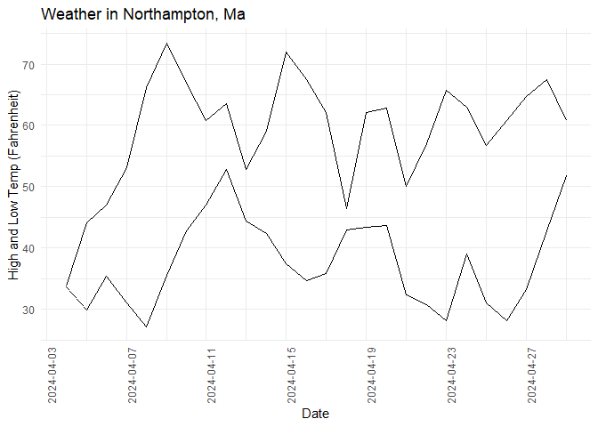

<!-- README.md is generated from README.Rmd. Please edit that file -->

# weather

<!-- badges: start -->
<!-- badges: end -->

The weather package retrieves weather data (highest temperature, lowest
temperature, precipitation) from various websites and provides users
with useful functions for data manipulation and visualization.

## Installation

You can install the development version of weather from
[GitHub](https://github.com/) with:

``` r
# install.packages("devtools")
devtools::install_github("JuliaYu2002/weather")
```

## Usage

At any date, you can get weather data of Northampton, MA for the next 14
days from weather.com.

This package also has function that retrieves the highest and lowest
temperature or the precipitation data for the past 30 days at a specific
location.

``` r
library(weather)

noho_forecast <- weather_noho()
print(noho_forecast)
#>        Day       Date           Status High Low Precipitation Type
#> 1  Tonight 2024-04-28    Showers Early   NA  56               Rain
#> 2   Mon 29 2024-04-29    Partly Cloudy   76  50               Rain
#> 3   Tue 30 2024-04-30           Cloudy   68  48               Rain
#> 4   Wed 01 2024-05-01       AM Showers   64  48               Rain
#> 5   Thu 02 2024-05-02    Partly Cloudy   76  48               Rain
#> 6   Fri 03 2024-05-03    Mostly Cloudy   74  48               Rain
#> 7   Sat 04 2024-05-04          Showers   69  49               Rain
#> 8   Sun 05 2024-05-05 AM Clouds/PM Sun   71  48               Rain
#> 9   Mon 06 2024-05-06    Partly Cloudy   69  47               Rain
#> 10  Tue 07 2024-05-07    Partly Cloudy   65  45               Rain
#> 11  Wed 08 2024-05-08       AM Showers   65  45               Rain
#> 12  Thu 09 2024-05-09    Mostly Cloudy   65  46               Rain
#> 13  Fri 10 2024-05-10          Showers   65  46               Rain
#> 14  Sat 11 2024-05-11    Mostly Cloudy   68  48               Rain
#> 15  Sun 12 2024-05-12          Showers   68  47               Rain
#>    Precipitation Chance Wind Direction Wind Speed        City         State
#> 1                    41              W         10 Northampton Massachusetts
#> 2                     7              N          8 Northampton Massachusetts
#> 3                    24             SE          8 Northampton Massachusetts
#> 4                    44            ENE          6 Northampton Massachusetts
#> 5                    13             SW          9 Northampton Massachusetts
#> 6                     9             SE          9 Northampton Massachusetts
#> 7                    43             SE          9 Northampton Massachusetts
#> 8                    24             SW          9 Northampton Massachusetts
#> 9                    24              W         10 Northampton Massachusetts
#> 10                   15             NW         10 Northampton Massachusetts
#> 11                   32             NW         10 Northampton Massachusetts
#> 12                   22             NW         11 Northampton Massachusetts
#> 13                   39             NW         10 Northampton Massachusetts
#> 14                   22             NW          9 Northampton Massachusetts
#> 15                   44            WNW          9 Northampton Massachusetts

noho_past <- past_days(city = "northampton", 
                       state ="massachusetts", 
                       zip = "01060")
print(noho_past)
#>           City State  High   Low       Date Precipitation
#> 1  Northampton    MA 37.76 35.96 2024-04-03         0.000
#> 2  Northampton    MA 38.30 33.62 2024-04-04         0.005
#> 3  Northampton    MA 44.06 29.84 2024-04-05         0.002
#> 4  Northampton    MA 46.94 35.42 2024-04-06         0.000
#> 5  Northampton    MA 53.06 31.10 2024-04-07         0.000
#> 6  Northampton    MA 66.20 27.14 2024-04-08         0.000
#> 7  Northampton    MA 73.40 35.60 2024-04-09         0.000
#> 8  Northampton    MA 66.92 42.80 2024-04-10         0.024
#> 9  Northampton    MA 60.80 46.94 2024-04-11         0.130
#> 10 Northampton    MA 63.50 52.88 2024-04-12         0.530
#> 11 Northampton    MA 52.88 44.42 2024-04-13         0.016
#> 12 Northampton    MA 59.00 42.44 2024-04-14         0.046
#> 13 Northampton    MA 71.96 37.40 2024-04-15         0.000
#> 14 Northampton    MA 67.46 34.70 2024-04-16         0.000
#> 15 Northampton    MA 62.06 35.78 2024-04-17         0.001
#> 16 Northampton    MA 46.40 42.98 2024-04-18         0.262
#> 17 Northampton    MA 62.06 43.34 2024-04-19         0.000
#> 18 Northampton    MA 62.78 43.70 2024-04-20         0.182
#> 19 Northampton    MA 50.00 32.36 2024-04-21         0.000
#> 20 Northampton    MA 57.02 30.74 2024-04-22         0.000
#> 21 Northampton    MA 65.66 28.22 2024-04-23         0.000
#> 22 Northampton    MA 62.96 39.02 2024-04-24         0.003
#> 23 Northampton    MA 56.66 31.10 2024-04-25         0.000
#> 24 Northampton    MA 60.80 28.22 2024-04-26         0.000
#> 25 Northampton    MA 64.76 33.26 2024-04-27         0.013
#> 26 Northampton    MA 67.46 42.80 2024-04-28         0.260
```

You can also plot the precipitation or the high/low temperatures using
functions from this package:

``` r
hi_lo_past <-  to_hi_lo_temp(weather_data(noho_past))

plot(hi_lo_past)
```


